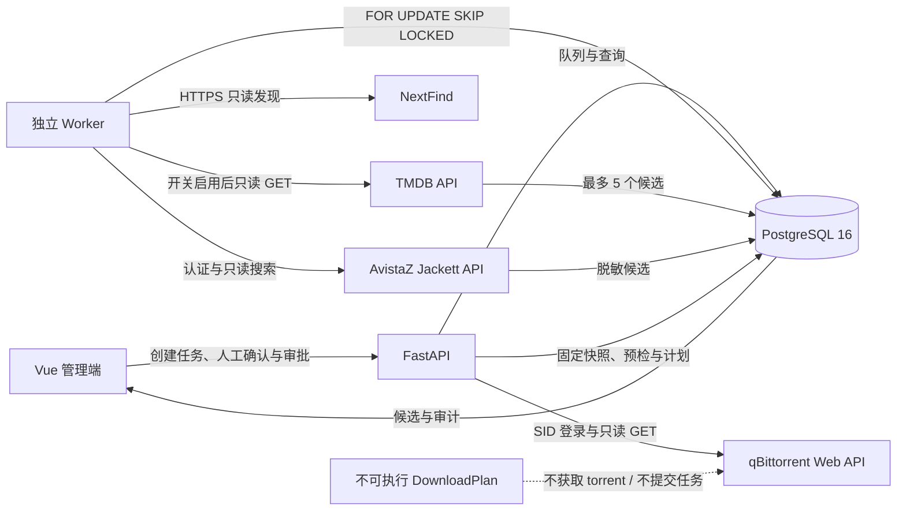
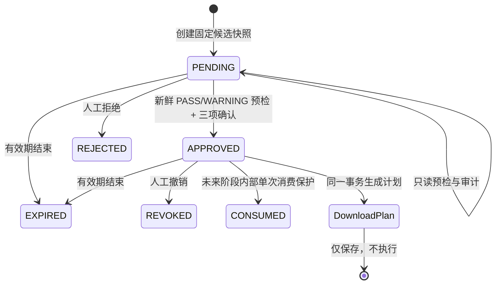

# 架构与状态流

第三阶段保留 NextFind、TMDB 和 AvistaZ 的只读发现与候选链路，并在人工审阅之后增加不可变候选审批、qBittorrent 只读预检和非执行下载计划。TMDB/AvistaZ 的外部任务仍由独立 Worker 执行；qBittorrent Secret 只挂载给 API，预检由 API 在一次人工请求中执行，Worker 和前端都拿不到 qB 凭据。



## 身份工作流

```text
DISCOVERED
  -> METADATA_PENDING
  -> IDENTITY_REVIEW
  -> IDENTITY_CONFIRMED
```

NextFind 已提供 TMDB ID 时，Worker 直接读取对应类型详情，不做模糊搜索；若该类型不存在，会只读检查相反类型以暴露类型冲突。年份或类型冲突都作为候选冲突进入 `IDENTITY_REVIEW`。没有 TMDB ID 时，按标题、年份和类型搜索最多 5 个候选。两条路径都不会自动确认，只有人工确认 API 能写入最终身份。

电视剧的 `episode_matrix` 只保留已播集；`TMDB_ALLOW_FUTURE_EPISODES=false` 是默认值。没有播出日期或播出日期在未来的集数不参与缺失集判断。

## PT 搜索工作流

```text
IDENTITY_CONFIRMED
  -> PT_SEARCH_PENDING
  -> PT_SEARCHING
  -> TORRENT_REVIEW | NO_CANDIDATE | SEARCH_FAILED
```

搜索策略固定按 TMDB ID、IMDb ID、英文名加年份、原名加年份、中文名或别名降级。首个返回候选的策略停止。候选由纯函数评分，外部 ID、类型、季集覆盖、年份和用户偏好的权重高于活跃度、促销与大小；评分只用于排序和解释，不会触发批准或下载。

## 审批工作流



审批只绑定一个 `torrent_candidates` 记录在申请时的完整快照。快照包含影视与候选标识、发布名、大小、info hash、季集、规格、字幕、做种、促销、H&R、匹配分数、理由、警告和有效期；不重新读取后续变化的候选。规范 JSON 使用 SHA-256 生成 `snapshot_hash`，读取和每次状态动作前都重新校验，且 `media_item_id`、`torrent_candidate_id`、申请时间和有效期必须与固定列一致。ORM 事件与 PostgreSQL trigger 禁止修改或删除固定审批字段；数据库的部分唯一索引禁止同一候选同时存在第二个 `PENDING` 或 `APPROVED` 审批。

`approval_events` 追加记录申请、预检、批准、下载计划创建、拒绝、撤销、过期和内部消费等事件，包括前后状态、操作者、原因、快照哈希与脱敏详情。事件外键为 `RESTRICT`，ORM 与 PostgreSQL trigger 禁止 UPDATE/DELETE。`CONSUMED` 只有内部服务保护函数，本阶段没有对应 API，也没有执行器；该函数自行使用 `SELECT ... FOR UPDATE` 串行化同一审批的消费。

批准前必须满足全部条件：

- 审批仍为 `PENDING` 且未过期；
- 已完成 qBittorrent 只读预检，结果未超过 `APPROVAL_PREFLIGHT_MAX_AGE_SECONDS`；
- 总体结果只能为 `PASS` 或 `WARNING`，`UNKNOWN` 不得视为通过；
- 操作者明确确认 H&R、下载完成后继续做种、当前阶段仅创建计划；
- 下载计划目标分类已配置。

批准与 `DownloadPlan` 在同一数据库事务中创建，但不会发起网络下载。一个审批最多对应一个计划；计划保存 `approval_snapshot_hash`、`preflight_policy_fingerprint` 和规范化 `plan_hash`，每次读取或内部消费前重新校验，ORM 与 PostgreSQL trigger 禁止计划 UPDATE/DELETE。

## qBittorrent 只读边界

`QbittorrentReadOnlyAdapter` 使用进程内 SID Cookie 会话，只实现以下上游调用：

```text
POST /api/v2/auth/login
GET  /api/v2/app/version
GET  /api/v2/app/webapiVersion
GET  /api/v2/torrents/info
GET  /api/v2/torrents/files
GET  /api/v2/torrents/categories
```

API 对前端只暴露 `/api/downloaders/qbittorrent/status` 和 `/api/downloaders/qbittorrent/torrents` 两个 `GET`。登录跳转不跟随，任何非 2xx 都是失败，HTML 登录页不能当作 JSON 成功；种子和文件模型严格限制进度、ratio、时间戳、大小和优先级范围。

前端 qB Pinia store 在请求开始和失败时清空旧状态，并为每次加载递增 generation；只有当前 generation 的响应才能写回，防止迟到响应覆盖新状态。store 不启用持久化。

## 下载前预检

预检每次从固定审批快照与 qB 只读状态计算，检查：

- qB 连接、应用版本和 Web API 版本；
- qB 应用版本是否命中 `AVISTAZ_FORBIDDEN_QB_VERSIONS` 通配规则；
- 目标分类是否存在；
- 是否已有相同 info hash；
- 是否有相同发布名和大小的疑似重复任务；
- 真实目标保存路径是否位于允许路径内；
- 候选大小是否超过用户限制；
- 当前是否存在活跃做种任务；
- 候选是否有做种者；
- H&R 信息是否已知。

总体状态按严重程度折叠：`BLOCKED > UNKNOWN > WARNING > PASS`。12 个必需检查代码必须各出现一次，服务会从明细重新计算汇总状态。预检保存不暴露真实路径的策略 SHA-256 指纹；分类、保存路径策略、大小限制、禁止版本规则、计划引用/标签或有效时限变化后必须重新预检。连接失败、相同 info hash、禁止版本、分类不存在、路径越界、超限或零做种者会阻断；缺失配置或无法确认的信息为 `UNKNOWN`；疑似重复发布与没有活跃做种任务为 `WARNING`。

## 数据与审计

- `metadata_matches`：TMDB 候选、排序、评分理由、冲突和候选快照。
- `identity_reviews`：人工确认、操作者、时间和当时的候选快照；每个影视只允许一条已确认记录。
- `torrent_search_runs`：搜索状态、脱敏请求、降级策略日志、候选数和稳定错误码。
- `torrent_candidates`：脱敏候选、评分、理由与警告。
- `approval_requests`：固定候选快照、SHA-256、有效期、状态和最近一次预检。
- `approval_events`：审批状态变化和预检的追加式脱敏审计记录。
- `download_plans`：每个已批准审批至多一个非执行计划，只含内部种子引用与保存位置引用。
- `jobs`：发现、身份解析、PT 搜索共用的可恢复数据库队列。
- `audit_events`：关键状态变更与人工操作的脱敏审计记录。

所有数据库时间写 UTC，前端按 `Asia/Shanghai` 展示。候选快照、审批事件和下载计划不含 Cookie、Token、PID、密码、真实下载 URL、announce URL、tracker 或 passkey。`torrent_ref` 与 `save_path_ref` 都是内部引用，计划中的 `media_destination_plan.mode` 固定为 `PLAN_ONLY_NO_FILE_OPERATION`。
