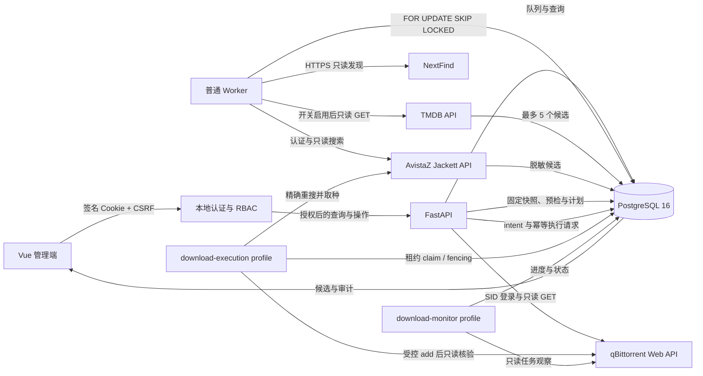
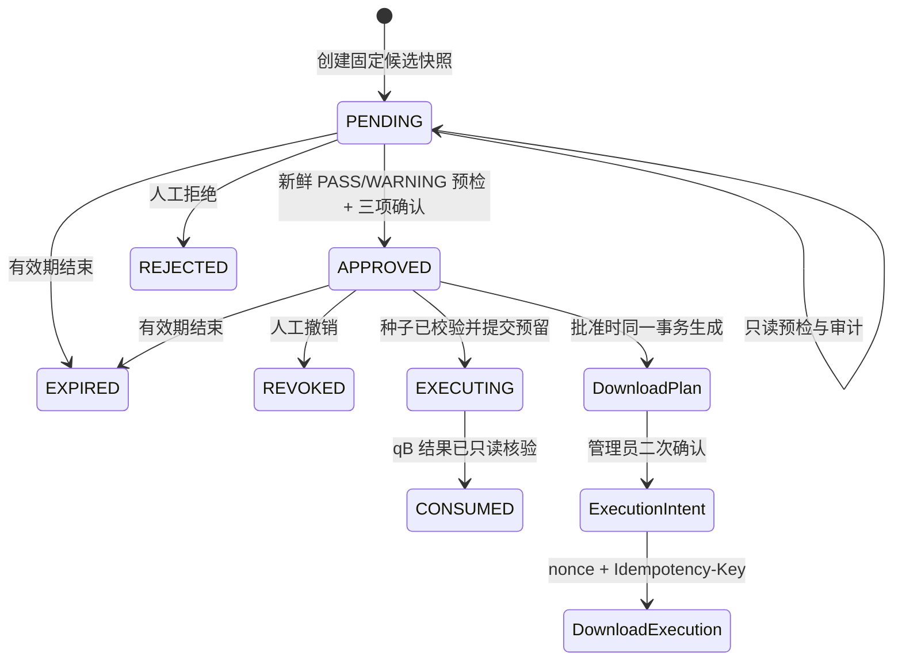

# 架构与状态流

版本 `0.5.0` 将系统拆成六个职责边界：FastAPI 控制面、普通发现 Worker、可选下载执行器、可选只读监控器、PostgreSQL 和 Vue 管理端。阶段 4 的 intent/execute/reconcile 只是默认关闭的数据库控制面；阶段 5 的真实 AvistaZ 取种与 qB add 位于独立执行器中，并由 Compose profile、三开关、审批绑定、租约 fencing 和写前闸门共同保护。媒体文件始终不在系统操作范围内。



## 认证与授权流

```text
GET /api/auth/csrf
  -> bootstrap CSRF Cookie + token
POST /api/auth/login (Cookie + X-CSRF-Token + 本地凭据)
  -> HttpOnly 签名会话 Cookie + 会话绑定 CSRF Cookie
GET 受保护资源
  -> 验证会话签名、有效期与 viewer 以上权限
POST 状态变更
  -> 额外验证 CSRF Cookie/Header + operator 或 admin 权限
```

认证材料不完整时受保护链路 fail closed。角色按 `viewer < operator < admin` 继承：读取用户数据至少需要 viewer；一般工作流写入需要 operator；审批批准与撤销需要 admin。服务端把会话用户名传入工作流和审批服务作为 actor，不信任请求体中的操作者字段。会话无状态且由 HMAC 签名，轮换 `auth_session_signing_key` 会使全部现有会话失效。

## 身份工作流

```text
DISCOVERED
  -> METADATA_PENDING
  -> IDENTITY_REVIEW
  -> IDENTITY_CONFIRMED
```

NextFind 已提供 TMDB ID 时，Worker 直接读取对应类型详情，不做模糊搜索；若该类型不存在，会只读检查相反类型以暴露类型冲突。年份或类型冲突都作为候选冲突进入 `IDENTITY_REVIEW`。没有 TMDB ID 时，按标题、年份和类型搜索最多 5 个候选。两条路径都不会自动确认，只有人工确认 API 能写入最终身份。

电视剧的 `episode_matrix` 只保留已播集；`TMDB_ALLOW_FUTURE_EPISODES=false` 是默认值。没有播出日期或播出日期在未来的集数不参与缺失集判断。

## PT 搜索工作流

```text
IDENTITY_CONFIRMED
  -> PT_SEARCH_PENDING
  -> PT_SEARCHING
  -> TORRENT_REVIEW | NO_CANDIDATE | SEARCH_FAILED
```

搜索策略固定按 TMDB ID、IMDb ID、英文名加年份、原名加年份、中文名或别名降级。首个返回候选的策略停止。候选由纯函数评分，外部 ID、类型、季集覆盖、年份和用户偏好的权重高于活跃度、促销与大小；评分只用于排序和解释，不会触发批准或下载。

搜索数据模型、job type 和 Worker 已按 `site_id` 隔离。`PtSiteRegistry` 保存工厂而非凭据；未知、未启用、payload/run 绑定不一致或候选站点不一致时失败关闭，不会回退到 AvistaZ。默认生产注册表仍只包含 `avistaz`，公开搜索创建路由当前也只放行 `avistaz`。

NexusPHP 扩展只实现了无 Secret 的声明式 `NexusPhpSiteProfile`、HTML parser、严格同源会话和本地 fixture 测试契约。Profile 描述 HTTPS origin、同源路径、分类/查询映射和 CSS selector，默认 `enabled=false`；Cookie/passkey 只能在适配器进程内存中提供。该骨架不表示任何真实国内站点可用，也不会绕过登录页、验证码或浏览器挑战。完整边界见 `docs/pt-site-profiles.md`。

## 审批工作流



审批只绑定一个 `torrent_candidates` 记录在申请时的完整快照。快照包含影视与候选标识、发布名、大小、info hash、季集、规格、字幕、做种、促销、H&R、匹配分数、理由、警告和有效期；不重新读取后续变化的候选。规范 JSON 使用 SHA-256 生成 `snapshot_hash`，读取和每次状态动作前都重新校验，且 `media_item_id`、`torrent_candidate_id`、申请时间和有效期必须与固定列一致。ORM 事件与 PostgreSQL trigger 禁止修改或删除固定审批字段；数据库的部分唯一索引禁止同一候选同时存在第二个 `PENDING` 或 `APPROVED` 审批。

`approval_events` 追加记录申请、预检、批准、下载计划创建、执行意图、执行请求、提交预留、拒绝、撤销、过期和消费等事件，包括前后状态、操作者、原因、快照哈希与脱敏详情。事件外键为 `RESTRICT`，ORM 与 PostgreSQL trigger 禁止 UPDATE/DELETE。阶段 4 控制面创建 `PENDING` 执行记录时不会提前消费审批；阶段 5 执行器只有在已校验 `.torrent` 后才将审批置为 `EXECUTING`，并在 qB 提交结果再次读取验证且唯一 `DownloadJob` 创建成功后置为 `CONSUMED`。

批准前必须满足全部条件：

- 审批仍为 `PENDING` 且未过期；
- 已完成 qBittorrent 只读预检，结果未超过 `APPROVAL_PREFLIGHT_MAX_AGE_SECONDS`；
- 总体结果只能为 `PASS` 或 `WARNING`，`UNKNOWN` 不得视为通过；
- 操作者明确确认 H&R、下载完成后继续做种、当前阶段仅创建计划；
- 下载计划目标分类已配置。

批准与 `DownloadPlan` 在同一数据库事务中创建，但不会发起网络下载。一个审批最多对应一个计划；计划保存 `approval_snapshot_hash`、`preflight_policy_fingerprint` 和规范化 `plan_hash`，每次读取或内部消费前重新校验，ORM 与 PostgreSQL trigger 禁止计划 UPDATE/DELETE。

## 下载执行控制面

阶段 4 增加纯数据库控制面，默认由 `ENABLE_DOWNLOAD_EXECUTION_CONTROL_PLANE=false` 关闭。创建执行意图和提交执行请求只允许 `admin`，所有写请求继续要求会话 CSRF；查询允许 `viewer`。控制面没有 AvistaZ 取种、qBittorrent 请求或文件操作代码路径。

```text
POST /api/approval-requests/{id}/execution-intents
  -> 返回一次 nonce；数据库只保存 SHA-256
POST /api/approval-requests/{id}/execute + Idempotency-Key
  -> 只创建 PENDING download_execution
POST /api/download-executions/{id}/reconcile
  -> OUTCOME_UNKNOWN/RECONCILIATION_REQUIRED 仅进入 RECONCILIATION_PENDING
```

执行意图绑定审批快照哈希、不可变下载计划哈希、qB 目标指纹、启动模式和有效期。同一审批最多一个 `ACTIVE` 意图；nonce 只在创建响应出现一次，审批事件、执行事件、后续 GET 和数据库都不保存原文。执行请求以全局唯一的 `Idempotency-Key` SHA-256、审批唯一约束和 intent 唯一约束共同防重；相同键与相同请求返回原记录，不同请求复用同一键返回冲突。审批行使用 `SELECT ... FOR UPDATE` 串行化创建。

`download_executions` 初始状态固定为 `PENDING`，审批继续保持 `APPROVED`。`ADD_PAUSED` 是前端和 schema 默认启动模式；`START_IMMEDIATELY` 必须由管理员在一次性 intent 中显式选择。`OUTCOME_UNKNOWN`、`RECONCILIATION_REQUIRED` 与 `RECONCILIATION_PENDING` 均禁止自动重试；reconcile 只记录人工对账请求，不访问 qB。

## 下载执行器

`download-execution` Compose profile 中的独立执行器只有在以下三个开关同时为真时才运行：

```text
ENABLE_DOWNLOAD_EXECUTOR=true
ENABLE_AVISTAZ_TORRENT_FETCH=true
ENABLE_QB_WRITE=true
```

它还要求 AvistaZ 实时搜索和运行时凭据、qB 运行时凭据与目标策略已配置。处理顺序固定如下：

```text
PENDING | 到期的 RETRY_WAIT
  -> VALIDATING（数据库时间、FOR UPDATE SKIP LOCKED、租约 token 与心跳）
  -> AvistaZ 精确重搜已批准 torrent ID
  -> 获取并校验 bencode、v1/v2 hash、大小与文件数
  -> 同一事务持久化实际摘要，Approval -> EXECUTING，Execution -> SUBMITTING
  -> 按全部 hash alias 查询 qB；真正 POST 前再次执行数据库 write guard
  -> add 或确认 ALREADY_PRESENT
  -> 重新读取 qB 并核验 hash、分类、保存路径和大小
  -> Approval -> CONSUMED，Execution -> SUBMITTED | ALREADY_PRESENT
  -> 创建唯一 DownloadJob
```

执行器在每个外部请求前复验审批、状态、worker、lease token 和基于数据库时间的租约有效期。写入前的可重试校验错误才会进入指数退避的 `RETRY_WAIT`；`SUBMITTING` 后租约失效进入 `RECONCILIATION_REQUIRED`。qB POST 可能已经发生但无法验证时进入 `OUTCOME_UNKNOWN`。这三种对账状态的 `next_retry_at` 为空，执行器绝不自动再次 add。

## 下载监控与总结

`download-monitor` profile 要求 `ENABLE_DOWNLOAD_MONITOR=true` 和 `ENABLE_QB_READ_ONLY=true`。监控器只登录并读取 qB 任务列表，以 v1/v2 hash alias 关联 `DownloadJob`，更新 `QUEUED`、`DOWNLOADING`、`PAUSED`、`CHECKING`、`SEEDING`、`COMPLETED`、`MISSING` 或 `ERROR`，以及进度、速度、流量、Ratio、完成时间和最后观察时间。分类或大小漂移会进入 `ERROR`。

监控器不调用任何 qB mutation，也不从 qB 状态、Ratio 或做种时长推断 H&R。新任务初始为 `UNKNOWN`，已有 `AT_RISK`/`SATISFIED` 值不会被监控器覆盖。总结 API 固定返回 `job/media/approval/execution/warnings`，时间线按时间合并 approval、execution、job 三类追加式事件并再次脱敏。

## qBittorrent 只读边界

`QbittorrentReadOnlyAdapter` 使用进程内 SID Cookie 会话，只实现以下上游调用：

```text
POST /api/v2/auth/login
GET  /api/v2/app/version
GET  /api/v2/app/webapiVersion
GET  /api/v2/torrents/info
GET  /api/v2/torrents/files
GET  /api/v2/torrents/categories
```

API 对前端只暴露 `/api/downloaders/qbittorrent/status` 和 `/api/downloaders/qbittorrent/torrents` 两个 `GET`。登录跳转不跟随，任何非 2xx 都是失败，HTML 登录页不能当作 JSON 成功；种子和文件模型严格限制进度、ratio、时间戳、大小和优先级范围。

前端 qB Pinia store 在请求开始和失败时清空旧状态，并为每次加载递增 generation；只有当前 generation 的响应才能写回，防止迟到响应覆盖新状态。store 不启用持久化。

## 下载前预检

预检每次从固定审批快照与 qB 只读状态计算，检查：

- qB 连接、应用版本和 Web API 版本；
- qB 应用版本是否命中 `AVISTAZ_FORBIDDEN_QB_VERSIONS` 通配规则；
- 目标分类是否存在；
- 是否已有相同 info hash；
- 是否有相同发布名和大小的疑似重复任务；
- 真实目标保存路径是否位于允许路径内；
- 候选大小是否超过用户限制；
- 当前是否存在活跃做种任务；
- 候选是否有做种者；
- H&R 信息是否已知。

总体状态按严重程度折叠：`BLOCKED > UNKNOWN > WARNING > PASS`。12 个必需检查代码必须各出现一次，服务会从明细重新计算汇总状态。预检保存不暴露真实路径的策略 SHA-256 指纹；分类、保存路径策略、大小限制、禁止版本规则、计划引用/标签或有效时限变化后必须重新预检。连接失败、相同 info hash、禁止版本、分类不存在、路径越界、超限或零做种者会阻断；缺失配置或无法确认的信息为 `UNKNOWN`；疑似重复发布与没有活跃做种任务为 `WARNING`。

## 数据与审计

- `metadata_matches`：TMDB 候选、排序、评分理由、冲突和候选快照。
- `identity_reviews`：人工确认、操作者、时间和当时的候选快照；每个影视只允许一条已确认记录。
- `torrent_search_runs`：搜索状态、脱敏请求、降级策略日志、候选数和稳定错误码。
- `torrent_candidates`：脱敏候选、评分、理由与警告。
- `approval_requests`：固定候选快照、SHA-256、有效期、状态和最近一次预检。
- `approval_events`：审批状态变化和预检的追加式脱敏审计记录。
- `download_plans`：每个已批准审批至多一个不可变计划，只含内部种子引用与保存位置引用；计划本身不执行外部动作。
- `execution_intents`：一次性 nonce 摘要及审批、计划、qB 目标和启动模式绑定。
- `download_executions`：幂等执行请求、租约/fencing、实际 v1/v2 info hash、验证时间和对账状态。
- `download_execution_events`：不可变的执行状态与对账审计事件。
- `download_jobs`：提交后经 qB 只读核验创建的唯一任务，保存公开路径引用、进度、流量、Ratio 与 H&R 状态。
- `download_job_events`：任务创建与状态变化的追加式脱敏事件。
- `jobs`：发现、身份解析、PT 搜索共用的可恢复数据库队列。
- `audit_events`：关键状态变更与人工操作的脱敏审计记录。

所有数据库时间写 UTC，前端按 `Asia/Shanghai` 展示。候选快照、审批事件、执行响应、下载计划与任务 API 不含 Cookie、Token、PID、密码、真实下载 URL、announce URL、tracker、passkey、lease token、真实 qB URL 或真实保存路径。`torrent_ref` 与 `save_path_ref` 都是内部引用，计划中的 `media_destination_plan.mode` 固定为 `PLAN_ONLY_NO_FILE_OPERATION`；即使下载执行完成，也没有媒体文件操作。
